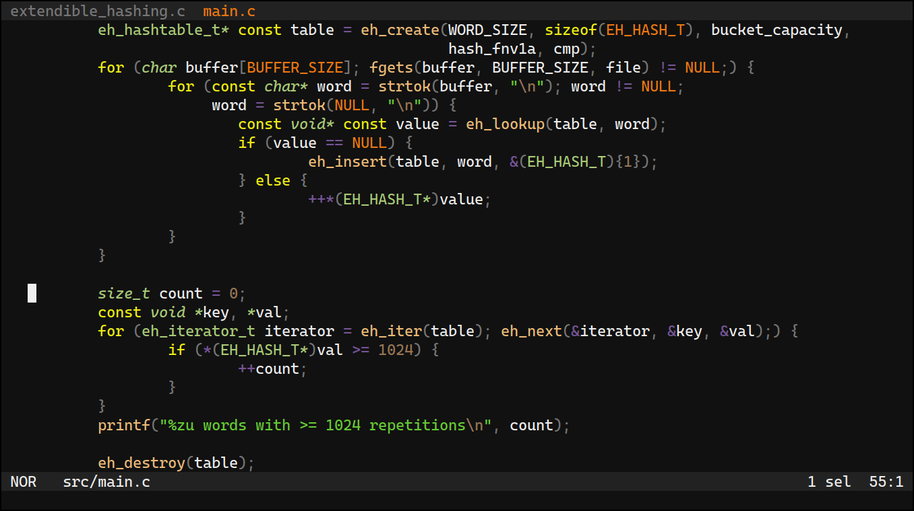

# Usage

Add sunset to your [helix](https://helix-editor.com/) themes:

```sh
mkdir -p "${XDG_CONFIG_HOME:-$HOME/.config}/helix/themes"
curl -o "${XDG_CONFIG_HOME:-$HOME/.config}/helix/themes/sunset.toml" https://raw.githubusercontent.com/pithecantrope/sunset/main/sunset.toml
```

Restart Helix and apply the theme:

```
:theme sunset
```

# LICENSE

This project is distributed under the MIT license.
