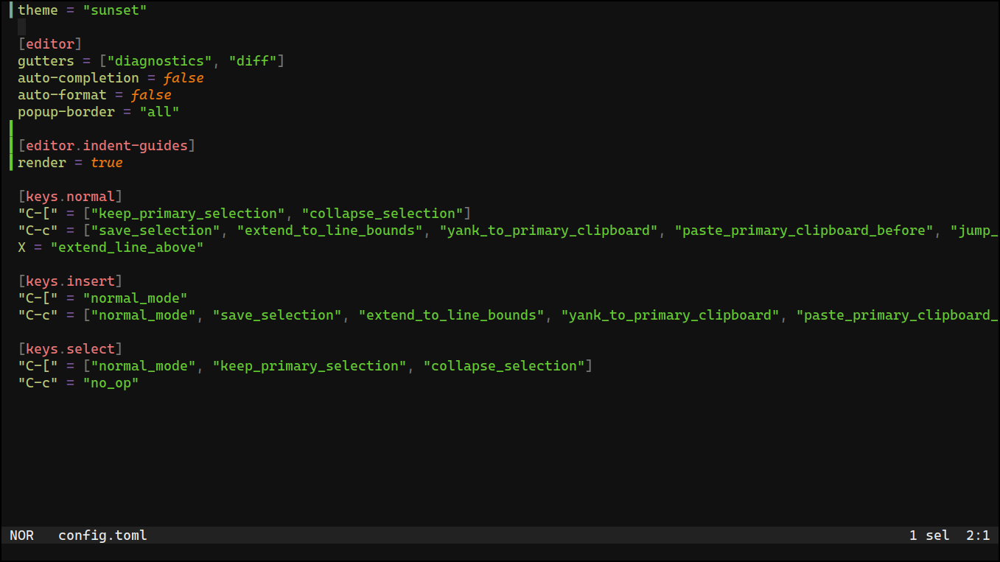
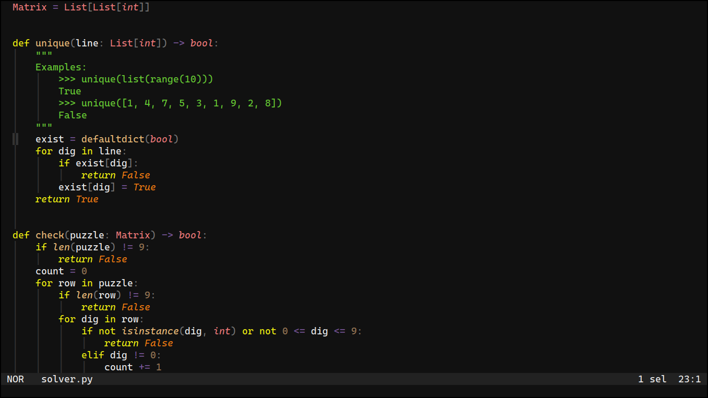
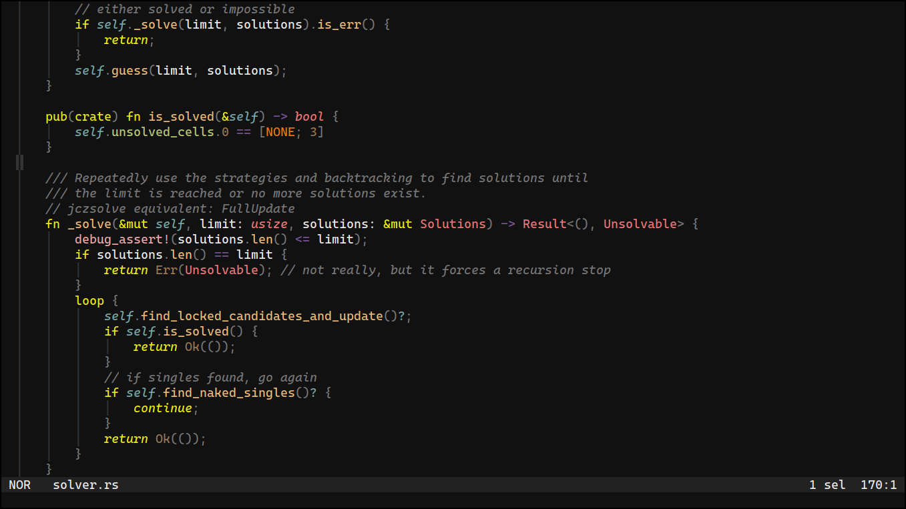
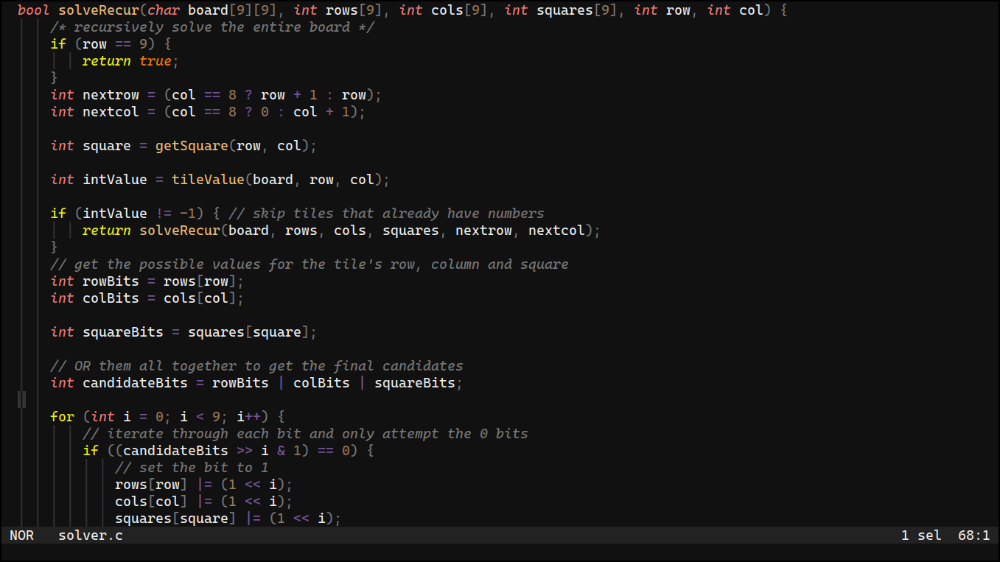

# Sunset

A cozy dark [helix](https://helix-editor.com/) theme designed to make your coding sessions feel warm and inviting.

## Usage

Add Sunset to your Helix themes:

```sh
mkdir -p $XDG_CONFIG_HOME/helix/themes
curl -o $XDG_CONFIG_HOME/helix/themes/sunset.toml https://raw.githubusercontent.com/pithecantrope/sunset/main/sunset.toml
```

Restart Helix and apply the theme:

```
:theme sunset
```

## Showcase









## LICENSE

This project is distributed under the MIT license.
